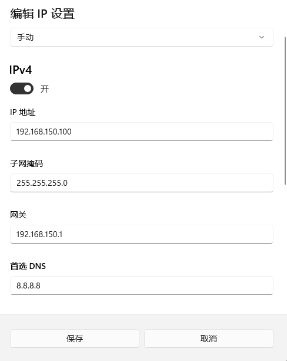
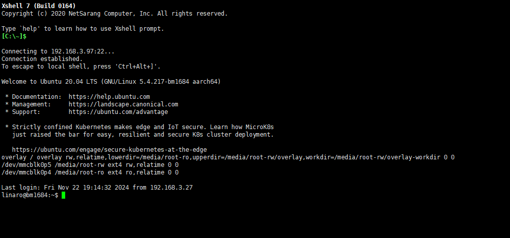
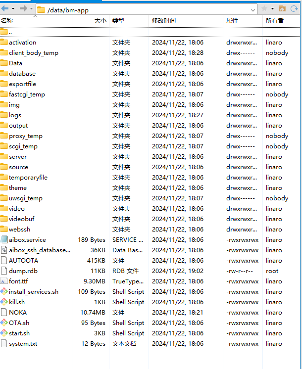
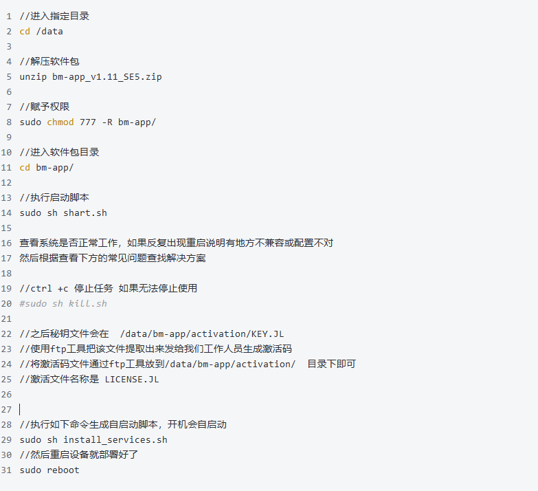
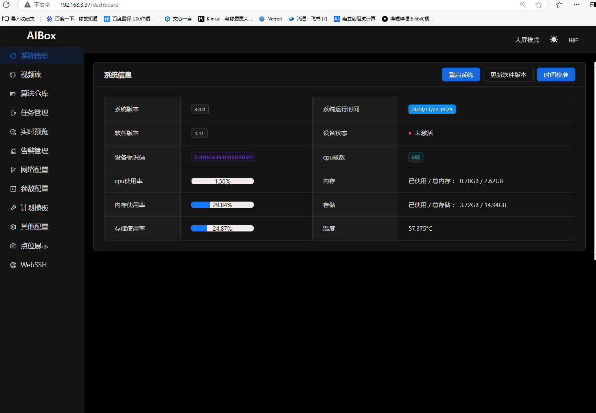

# AIBOX
这个是AI视觉分析软件包，提供web界面来管理AI视觉任务

目前只提供安装包，并且需要激活码才能正常使用

# 一，前期准备工作
## 1,准备如下
算法软件包（从Releases处下载指定版本），AI边缘计算盒子（SE5 SE7），网线，ssh工具和ftp工具（win10自带的工具也行，到处KEY文件会麻烦一点）

## 2，安装软件包

### a,使用网线连接电脑和AI盒子lan口，修改以太网适配器的IP地址，改为192.168.150.10（保证和AI盒子的IP同一网段，盒子lan口IP为固定192.168.150.1），设置如下

### b,使用xshell软件（ssh工具）连接AI盒子，账户:  linaro  密码:  linaro (不包含空格)，连接上AI盒子，连接界面如下

### c,使用ftp工具将软件包传输到  /data/ 目录下 因为存储空间都被分配到此目录下了

软件包的放置目录位置如下

### d,然后在ssh工具输入如下命令

### e,然后在浏览器输入192.168.150.1 就可以出现web界面了默认账号密码 admin/admin

---

# 二，有可能遇到的问题

## 1，找不到链接库

比如提示找不到libbm开头的链接库 有可能是start.sh脚本的目录不对，找到  export LD_LIBRARY_PATH=/data/bm-app/source/lib/:/opt/sophon/libsophon-0.5.0/lib/  修改
libsophon-0.5.0的版本号，如果不知道版本号可以到指定的目录下进行查看 /opt/sophon/

当然也有可能是 libbmcv.so 但是找不到 libbmcv.so.0  这个时候需要 sudo ln -s libbmcv.so  libbmcv.so.0 差什么补什么（因为有的盒子版本不同导致没有这种类似的链接库，需要手动链接）

## 2，重启设备之后自启动脚本不执行，看看是不是没有给脚本赋予权限

## 3，如果是其他的问题，可以联系我们技术人员
