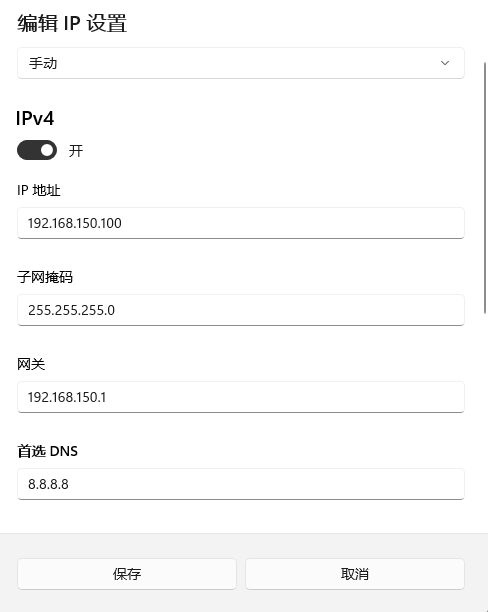

# AIBOX
这个是AI视觉分析软件包，提供web界面来管理AI视觉任务

目前只提供安装包，并且需要激活码才能正常使用

一，前期准备工作
1,准备如下
算法软件包（从Releases处下载指定版本），AI边缘计算盒子（SE5 SE7），网线，ssh工具和ftp工具（win10自带的工具也行，到处KEY文件会麻烦一点）

2，安装软件包

a,使用网线连接电脑和AI盒子lan口，修改以太网适配器的IP地址，改为192.168.150.10（保证和AI盒子的IP同一网段，盒子lan口IP为固定192.168.150.1），设置如下

b,使用xshell软件（ssh工具）连接AI盒子，账户:  linaro  密码:  linaro (不包含空格)，连接上AI盒子，连接界面如下

c,使用ftp工具将软件包传输到  /data/ 目录下 因为存储空间都被分配到此目录下了

d,然后在ssh工具输入如下命令

//进入指定目录 
cd /data
//解压软件包
unzip bm-app_0.71.zip
//进入软件包目录
cd bm-app/
//执行启动脚本
sh shart.sh
//ctrl +c 停止任务 如果无法停止使用
#sh kill.sh
//之后秘钥文件会在  /data/bm-app/activation/KEY.JL  
//使用ftp工具把该文件提取出来发给我们工作人员生成激活码
//将激活码文件通过ftp工具放到/data/bm-app/activation/  目录下即可
//激活文件名称是 LICENSE.JL
//执行如下命令生成自启动脚本，开机会自启动
sudo sh install_services.sh
//然后重启设备就部署好了
sudo reboot